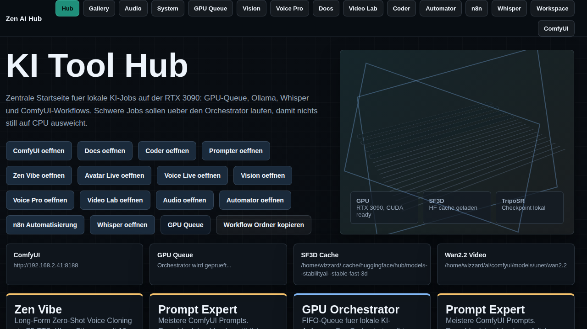

# GPU AI Hub

[](https://github.com/DerMilchjieper/gpu-ai-hub/actions/workflows/ci.yml)
[](LICENSE)



GPU AI Hub is a local-first AI workspace and accelerator control plane for a
home network. It combines service discovery, hardware-aware placement,
authenticated workspace tools, and a persistent job queue behind one browser
entrypoint.

> **Status: public alpha.** The full installer includes profiles for Ollama,
> SearXNG, n8n, ComfyUI with curated workflows, and a faster-whisper API.
> Large model files remain explicit downloads because their licenses and
> hardware requirements differ.

## Implemented alpha features

- authenticated English-language LAN web workspace
- chat through Ollama and side-by-side model comparison
- SearXNG-backed research
- notes, tasks, and calendar events
- service registry and opt-in private-/24 network discovery
- NVIDIA, AMD ROCm, and Apple Silicon hardware probes
- topology recommendations for single, homogeneous, and mixed accelerators
- persistent SQLite jobs with leases and scheduling-mode metadata
- Ollama job execution and remote worker heartbeats
- model profiles with explicit pull commands
- Docker control plane plus Linux/macOS and Windows bootstrap scripts
- seven curated ComfyUI image, video, upscale, and 3D workflows
- required ComfyUI custom nodes in the creative container image
- faster-whisper transcription API with CPU and NVIDIA modes
- Caddy gateway on port 80

## Install

### Linux and macOS

```bash
git clone https://github.com/DerMilchjieper/gpu-ai-hub.git
cd gpu-ai-hub
./scripts/install.sh
```

### Windows

Install Docker Desktop, clone the repository, then run:

```powershell
.\scripts\install.ps1
```

The preferred LAN URL is:

```text
http://ai-tool-hub.local/
```

The installer also prints an IP-based fallback. The generated initial admin
password is available through `docker compose logs hub`.

### Models

```bash
./scripts/pull-models.sh minimal
./scripts/pull-models.sh recommended
./scripts/pull-models.sh large
```

Model downloads are deliberately separate because hardware, disk space, and
licenses differ.

The full installer asks once before enabling the creative, speech, research,
and automation profiles. NVIDIA hosts use the GPU Compose overlay. Apple
Silicon installs ComfyUI natively so Metal remains available. Provider ports
bind to loopback by default and are exposed to a trusted LAN only after an
explicit installer confirmation.

## Discovery and workers

Network scanning is never automatic. An admin chooses a private IPv4 network no
larger than `/24`. Detected Ollama, ComfyUI, Whisper, n8n, LM Studio, and
OpenAI-compatible endpoints must be accepted before registration.

A remote machine can report its hardware to the control plane:

```bash
HUB_CONTROL_URL=http://ai-tool-hub.local \
HUB_WORKER_TOKEN=<shared-pairing-token> \
python -m hub.worker
```

Workers report capabilities, claim worker-targeted Ollama jobs with expiring
leases, execute them locally, and return bounded result summaries. Gang
scheduling and provider lifecycle control remain later scheduler slices.

## Scheduling policy

- one accelerator: serialized queue
- mixed accelerators: independent workers, largest models on the largest device
- similar accelerators: one provider instance per device for throughput
- pooling: only when the engine explicitly supports tensor/pipeline parallelism
- Apple Silicon: one Metal worker governed by unified-memory pressure
- cross-host: distribute jobs; never represent networked memory as shared VRAM

Accepted scheduling modes are `auto`, `sequential`, `parallel`,
`broadcast`, `pipeline`, and `gang`. The alpha executor currently runs
`ollama.generate`; remote Ollama execution is functional; other provider-specific executors are
added independently.

## Security

LAN mode requires authentication. Session cookies are HttpOnly/SameSite,
mutations require a CSRF token, discovery is restricted to configured private
networks, and the status API omits complete job payloads.

Do not expose the raw app or provider ports directly to the public internet.
Shell, filesystem, email-send, and MCP mutation capabilities are not enabled in
this alpha.

## Development

```bash
python3 -m venv .venv
.venv/bin/pip install -e '.[dev]'
.venv/bin/pytest -q
docker build -t gpu-ai-hub:dev .
```

Architecture details: [docs/ARCHITECTURE.md](docs/ARCHITECTURE.md).
Public release checklist: [docs/PUBLIC_RELEASE.md](docs/PUBLIC_RELEASE.md).

## License

GPU AI Hub's original code and documentation are licensed under
[Apache License 2.0](LICENSE). Integrated third-party projects and downloaded
models remain under their respective licenses; see
[THIRD_PARTY_NOTICES.md](THIRD_PARTY_NOTICES.md).

## Project status

This repository contains only the portable implementation. Workstation-specific
legacy portals and systemd units are intentionally excluded.
